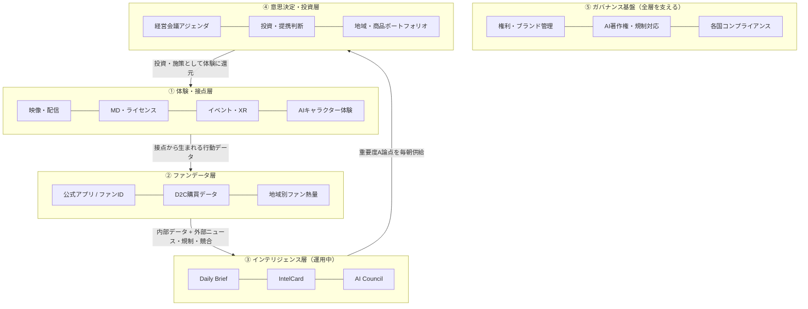

# 円谷プロダクション様向けご提案

## ウルトラマンIP活用グランドデザイン — データとAIでIP価値を最大化する

> IPの価値は「作品の数」ではなく「ファンとの接点の質 × 意思決定の速さ」で決まる時代へ

---

## 1. エグゼクティブサマリー

| 項目 | 内容 |
|---|---|
| 提案名 | **ウルトラマンIP活用グランドデザイン** — インテリジェンス駆動のIP価値最大化構想 |
| 現在地 | 意思決定層の基盤「Tsuburaya Intelligence Brief」は**すでに日次運用中**（毎朝7:00 Brief配信 / IntelCard / AI Council / Notion連携） |
| 本提案 | この基盤を中核に、**体験・接点 → ファンデータ → インテリジェンス → 意思決定・投資** が循環する「IPバリュー・フライホイール」を段階的に構築する |
| 施策 | ①AIキャラクター体験 ②地域別グローバル展開 ③MD/ライセンス高度化 ④ファンコミュニティ&CRM ⑤インテリジェンス駆動経営（運用中） |
| 進め方 | Phase 1（運用中）→ Phase 2（3〜6ヶ月: データ統合）→ Phase 3（6〜18ヶ月: AI体験・グローバル収益化） |

---

## 2. 環境認識 — IPビジネスの構造変化

ウルトラマンIPを取り巻く環境は、追い風と地殻変動が同時に来ています。

1. **キダルト・コレクター市場の急拡大**
   Pop Mart・Funko・高価格帯フィギュアに象徴される「大人が自分のためにIP商品を買う」市場が世界的に成長。子ども向け中心だったMDの価格帯設計が根本から変わりつつある。
2. **配信によるグローバル認知の非連続な拡大**
   Netflix等のグローバル配信により、一作品で数十カ国のファン接点が同時に生まれる構造に。「認知はあるが収益化導線がない」地域が急増している。
3. **生成AIによる制作・翻訳・ファン体験の変化**
   AI翻訳・吹替で多言語展開コストが劇的に低下。一方でAIキャラクター対話・二次創作の爆発は、体験機会であると同時に権利リスクでもある。
4. **中国・東南アジアの熱量**
   ウルトラマンが構造的に強い地域で、ライブコマース・ブラインドボックス・現地イベントなど収益化の型が急速に進化している。
5. **規制の複雑化**
   AI著作権、子ども向けコンテンツ・SNS規制、各国データ保護。グローバル展開ほどガバナンスが競争力になる。

**この変化の速さに対して、経営の意思決定サイクルをどう追いつかせるか** — が本グランドデザインの出発点です。

---

## 3. 円谷IPの強みと機会

| 強み | それが生む機会 |
|---|---|
| 60年近い世代継承力（親子二世代・三世代ファン） | キダルト市場・ファミリー市場の両取り |
| 中国・東南アジアでの圧倒的熱量 | 地域特化の商品・体験・パートナー戦略で収益深耕 |
| キャラクター資産の層の厚さ（ヒーロー×怪獣） | コレクション性の高いMD・ゲーム・カード展開 |
| 特撮という独自の映像文化資産 | 配信×グローバルで「ジャンルの代表」ポジション |
| **意思決定インフラ（Intelligence Brief）が稼働済み** | 変化を毎朝「経営論点」に翻訳し、打ち手の速度で競う |

---

## 4. グランドデザイン — IPバリュー・フライホイール

IP活用を単発施策の束ではなく、**5層が循環する一つのシステム**として設計します。



### 各層の役割

| 層 | 役割 | 状態 |
|---|---|---|
| ① 体験・接点 | 映像・MD・イベント・AI体験でファンと出会う | 既存事業 + 本提案で拡張 |
| ② ファンデータ | 接点を「誰が・どこで・何に熱狂しているか」のデータに変える | Phase 2 で構築 |
| ③ インテリジェンス | 外部環境（ニュース・規制・競合・技術）を経営論点に翻訳 | **運用中**（Intelligence Brief） |
| ④ 意思決定・投資 | 重要度A論点を経営アジェンダ化し、投資配分を機動的に見直す | Phase 2 で会議体に接続 |
| ⑤ ガバナンス | 権利保護・AI著作権・各国規制対応で全層を守る | 継続強化 |

**ポイント: ③はすでに動いています。** 円谷向けに日次運用中の Intelligence Brief（7カテゴリ監視 / 6エキスパートAI Council / 重要度A〜D分類）がフライホイールの回転軸であり、本グランドデザインは「ゼロからの構想」ではなく「稼働中のエンジンに層を足していく」提案です。

---

## 5. IP活用 5つの施策パッケージ

### A. AIキャラクター体験 🤖

- **多言語AIファンチャット**: ブランドセーフティを担保した公式AIキャラクター対話。海外ファンの言語障壁を消す
- **AI翻訳・吹替による配信ライブラリの多言語化**: 過去作品資産の海外収益化コストを大幅圧縮
- **判断軸**: AI Council の「AI技術トレンド × リスク管理 × IP戦略家」の三者議論スキームをそのまま適用し、ブランド毀損リスクを事前審査

### B. 地域別グローバル展開 🌏

- **中国・東南アジア**: 熱量の高い市場での現地パートナー・ライブコマース・限定商品の深耕
- **北米・欧州**: 配信起点の認知を、コレクター向けMD・イベントで収益に転換
- **判断軸**: Intelligence Brief の「グローバル・地域」カテゴリが地域別の勝ち筋・規制リスクを日次で供給

### C. MD/ライセンス高度化 🛍️

- **キダルト価格帯の本格開拓**: 大人向け高単価ライン・限定品・アーティストコラボ
- **D2C強化**: ライセンス経由では取れないファンデータと利益率を直接獲得
- **判断軸**: 「小売・MD・ライセンス」カテゴリ + CFO視点エキスパートでライセンス/直販の資本配分を継続評価

### D. ファンコミュニティ & CRM 📱

- **ファンIDの統合**: アプリ・EC・イベントの接点を一つのIDに束ね、LTVと地域別熱量を可視化
- **世代継承の設計**: 親子ファン・ライトファン・コレクターをセグメント別に育成
- **位置づけ**: フライホイール②層の中核。ここのデータが③インテリジェンスの精度を上げる

### E. インテリジェンス駆動経営 📊（運用中 → 深化）

- **現状**: 毎朝7:00に Daily Brief 配信、IntelCard 蓄積、AI Council 議論、Notion 同期まで自動化済み
- **深化**: 重要度Aカードを経営会議アジェンダに直結するフローの制度化、ファンデータ（②層）の取り込みによる「外部環境 × 自社データ」の統合分析

---

## 6. ロードマップ

| フェーズ | 期間 | 主な取り組み | ゴール |
|---|---|---|---|
| **Phase 1: インテリジェンス基盤**（現在） | 運用中 | Daily Brief / IntelCard / AI Council / 自動配信 | 外部環境の変化が毎朝「経営論点」として届く状態 ✅ |
| **Phase 2: データ統合と意思決定接続** | 3〜6ヶ月 | 重要度Aカードの経営会議アジェンダ化フロー制度化 / ファンID・D2Cデータの設計 / Watchlist拡充 | 「気づく → 議論する → 決める」のリードタイム半減 |
| **Phase 3: AI体験とグローバル収益化** | 6〜18ヶ月 | AIキャラクター体験PoC / AI多言語化による配信ライブラリ展開 / 地域別MD・D2C本格化 | 新規接点からの収益とファンデータがフライホイールに還流 |

---

## 7. KPIツリー（例）

```
IP価値最大化
├── 収益系
│   ├── ライセンス収益成長率 / 海外売上比率
│   ├── MD平均単価（キダルト価格帯比率）
│   └── D2C売上・粗利率
├── ファン系
│   ├── ファンID登録数 / アクティブ率
│   ├── 地域別ファン熱量スコア
│   └── 世代別ファン構成（継承指標）
└── 経営スピード系
    ├── 重要度Aカードの経営アジェンダ化率
    ├── 「検知 → 意思決定」リードタイム
    └── AI Council 結論の実行率
```

---

## 8. リスクとガバナンス

| リスク | 対応 |
|---|---|
| AIキャラクターによるブランド毀損・権利侵害 | AI Council のリスク管理エキスパート審査を必須ゲート化。公式AI体験はホワイトリスト型で段階公開 |
| AI著作権・学習データ規制の変動 | Intelligence Brief「規制・著作権」カテゴリで日次監視（実装済み）。重要変化は自動で重要度A起票 |
| 子ども向け規制・各国コンテンツ規制 | 地域展開判断に規制チェックを組み込み。グローバル展開エキスパート × リスク管理の複眼評価 |
| ファンデータのプライバシー | ファンID設計時に各国データ保護法準拠を要件化。データ最小化原則 |
| 投資の分散・共倒れ | CFO視点エキスパートによるROI・回収期間の定量評価を全施策に適用。フェーズゲート制 |

---

## 9. 推進体制（案）

- **IP戦略オーナー（経営企画）**: フライホイール全体のKPI責任。Brief の重要度A論点を経営会議へ
- **事業部リード（映像 / MD・ライセンス / 海外 / デジタル）**: 施策パッケージA〜Dの実行
- **リスク・法務**: ⑤ガバナンス基盤の運用。AI体験・海外展開の事前審査
- **AI Council（6エキスパート）**: 人間の会議体の「前さばき」として論点・選択肢・リスクを毎朝整理

---

## 10. まとめ

1. **IP活用を「単発施策」ではなく「体験 → データ → インテリジェンス → 意思決定」が循環するフライホイールとして設計する**
2. **回転軸となるインテリジェンス層はすでに日次運用中。ゼロからの構想ではなく、稼働中のエンジンに層を足す現実的な拡張**
3. **AI体験・グローバル・MD高度化・ファンCRMの4施策を、AI Council と重要度分類の実績ある判断スキームで規律を持って推進する**

まずは Phase 2 の第一歩として、**重要度Aカードを経営会議アジェンダに接続する運用ワークショップ**からの着手をご提案します。

---

*本書の記載内容・スケジュールは提案時点の想定であり、協議の結果により変動する可能性があります。*
